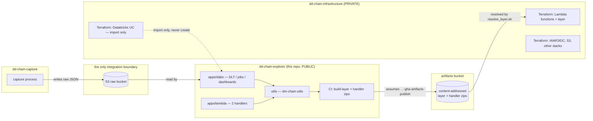

# Cross-repo contract — the artifact seam, the OIDC role map, the Databricks split

**Status:** pins the seam between the three repositories of the `dd-chain-explorer`
platform, authored before any of `dd-chain-infrastructure`'s artifact-consuming
Terraform (`prd/06_lambda`, `dev/02_lambda`) or this repository's artifact-publishing CI
job are written (v0.6.0 three-repo segregation, T-L.3). Both implementations cite this
document as the single source of the key shape and the role map — neither restates it,
and if either drifts from what is written here, this document is the one that is right.

No account id, host or personal identifier appears below — this repository is public.

---

## 1. The three repositories

| Repository | Concern | Visibility |
|---|---|---|
| `dd-chain-infrastructure` | All Terraform: IAM/OIDC bootstrap, S3, Lambda function/layer infrastructure, the Databricks workspace objects declared by import | Private |
| `dd-chain-explorer` (this repo) | Databricks Asset Bundles (DLT pipelines, batch jobs, dashboards) + the two AWS Lambda functions and their shared library | Public |
| `dd-chain-capture` | On-chain data capture | Untouched by this migration |

---

## 2. The artifacts bucket — prefixes and the content-addressed key shape

**Bucket:** `dm-chain-explorer-artifacts` (declared in `dd-chain-infrastructure`'s
`prd/04_peripherals` stack: versioned, private, all four public-access blocks on,
encrypted; `dev` consumes a `dev/` prefix of the same bucket).

Every object under this bucket is **content-addressed**: the key's basename (minus its
`.zip` suffix) IS the hex sha256 of the zip's bytes. A resolver never computes or
guesses a hash — it derives it from the key itself and, when present, cross-checks it
against the object's `sha256` metadata tag.

| Artifact | Prefix | Key shape | Producer |
|---|---|---|---|
| `dm-chain-utils` Lambda layer | `lambda-layers/dm-chain-utils/` | `lambda-layers/dm-chain-utils/<sha256>.zip` | this repo's CI (`scripts/build_lambda_layer.sh`, T-X.5) |
| Each Lambda handler zip | `lambda-handlers/<function>/` | `lambda-handlers/<function>/<sha256>.zip` (`<function>` = `contracts_ingestion` \| `gold_to_dynamodb`) | this repo's CI (T-X.5) |

The handler-zip prefix (`lambda-handlers/<function>/<sha256>.zip`) is **new at v0.6.0**
— the legacy single-repo platform only ever published the layer this way (the two
handler zips were built inline by `archive_file` in the pre-migration Terraform, a path
no longer available once the source tree lives in a different repository, ADR-3). It
follows the layer prefix's own shape exactly: `<kind>/<discriminator>/<sha256>.zip`.

---

## 3. Who publishes, who resolves

| Role | Repository | What it does |
|---|---|---|
| **Publisher** | `dd-chain-explorer` (this repo) | CI builds the layer (`pip install --require-hashes -r apps/lambda/requirements.txt -t build/` for third-party deps, plus `pip install ./utils -t build/ --no-deps` — the path install closes dependency confusion) and both handler zips, uploads each to its content-addressed key, and emits each `<sha256>` as a run output. |
| **Resolver** | `dd-chain-infrastructure` | `scripts/ci/resolve_layer.sh` (rewritten to also resolve each handler prefix, T-I.4) reads the newest object under a prefix — it never builds or uploads anything. Every infra-only plan/apply (`prd/06_lambda`, `dev/02_lambda`) names the artifact it applies by the sha256 this script reports; a missing object skips the plan **with a warning**, never plans against a stale artifact. |

The publisher and the resolver are two different repositories, two different CI
identities, and two different OIDC roles (§4) — the resolver can never write to the
bucket, and the publisher can never touch Terraform state or apply infrastructure.

---

## 4. The five-role OIDC map

All five roles are created and trust-repointed by `dd-chain-infrastructure`'s
`services/prd/00_bootstrap` stack — the one stack no CI role may ever apply (applied by
the operator only). Each carries this project's permissions boundary; none has a
managed-policy attachment or an `iam:*`/`sts:*` wildcard allowance.

| Role | Trusted repository | Trust condition | May do |
|---|---|---|---|
| `dm-chain-explorer-gha-deploy-dev` | `dd-chain-infrastructure` | `repo:<owner>/dd-chain-infrastructure:environment:dev` | Plan + apply the `dev` stacks |
| `dm-chain-explorer-gha-deploy-hml` | `dd-chain-infrastructure` | `repo:<owner>/dd-chain-infrastructure:environment:hml` | Plan + apply the `hml` stacks |
| `dm-chain-explorer-gha-deploy-prd` | `dd-chain-infrastructure` | `repo:<owner>/dd-chain-infrastructure:environment:production` | Plan + apply the `prd` stacks (excluding `prd/00_bootstrap` itself) |
| `dm-chain-explorer-gha-readonly-plan` | `dd-chain-infrastructure` | `pull_request` + `refs/heads/{develop,main}` | Read-only plan only (`-lock=false`); never applies |
| `dm-chain-explorer-gha-artifacts-publish` | `dd-chain-explorer` (this repo) | `repo:<owner>/dd-chain-explorer:…` | **Only** `s3:PutObject`, `s3:PutObjectTagging`, `s3:AbortMultipartUpload` on `dm-chain-explorer-artifacts/*` and `s3:ListBucket` on the bucket — no Terraform state access, no Lambda/IAM permission of any kind |

The four deploy/readonly roles trust `dd-chain-infrastructure`; the publish role trusts
this repository. Neither side can assume the other's role — the artifact seam (§2, §3)
is the only channel between them, mediated by S3 object contents, never by shared
credentials.

---

## 5. The Databricks split

| Layer | Where | Mechanism |
|---|---|---|
| Workspace infrastructure — storage credentials, external locations, catalogs | `dd-chain-infrastructure` | Terraform-by-import only (inventory first, then `terraform import` one object at a time, re-planning after each; a fail-closed stop on any object that cannot be imported — never `create`) |
| DLT pipelines, workflows, jobs, dashboards | `dd-chain-explorer` (this repo) | Databricks Asset Bundles (`apps/dabs/`), validated and deployed by this repository's own CI |

Terraform in `dd-chain-infrastructure` never declares a DLT pipeline, a job, a workflow
trigger or a dashboard — those are DABs resources, owned end-to-end by this repository.
Conversely, no `databricks.yml` bundle in this repository ever declares a storage
credential, an external location or a catalog — those are Terraform-imported resources
owned end-to-end by `dd-chain-infrastructure`. The two never overlap on the same object.

---

## 6. Re-pointed runbooks

`docs/runbooks/lambda-layer.md` and `docs/runbooks/ci-security.md` (migrated verbatim
from the legacy repository at T-X.3) referenced the legacy single-repo topology by name
— `deploy_all_dm_applications.yml` as the layer's sole producer, `services/**` paths for
Terraform this repository no longer owns. Both are re-pointed by this task (T-L.3) at
their new homes: the layer's producer is now this repository's own artifact-publish CI
job (§3), consumed from `dd-chain-infrastructure`'s `services/**` (a different
repository, not a local path).
